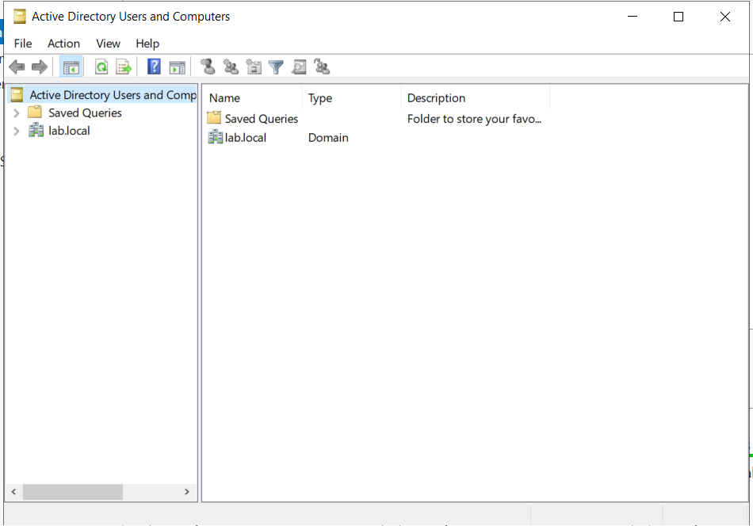
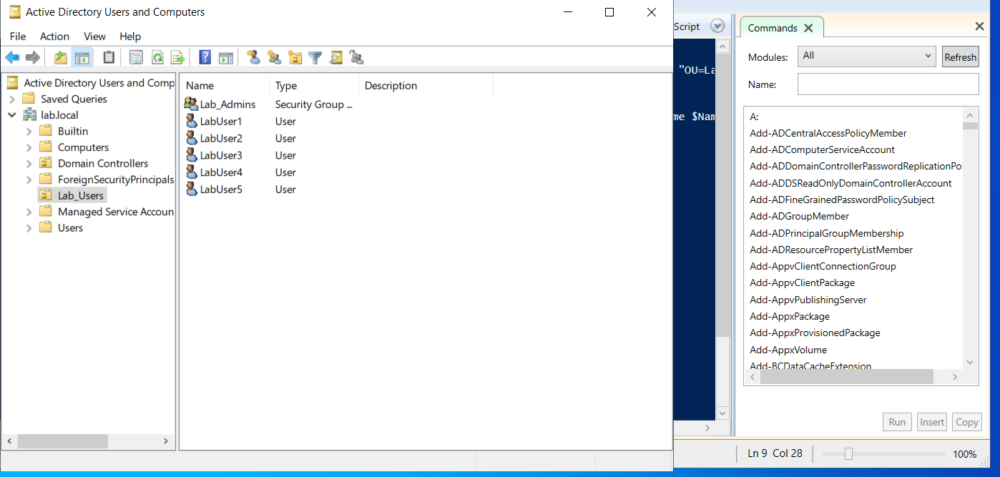
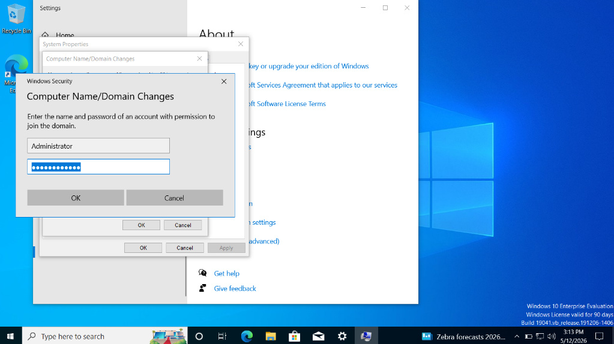
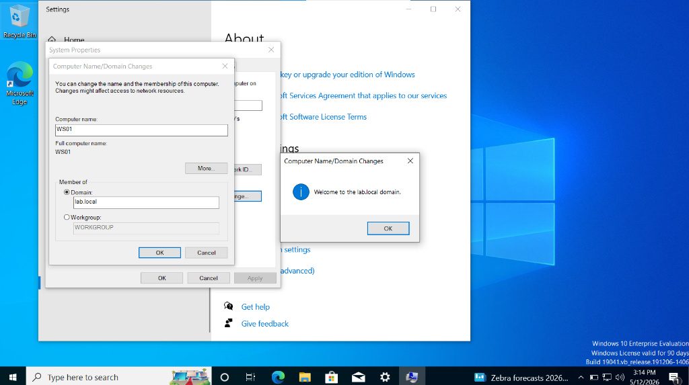
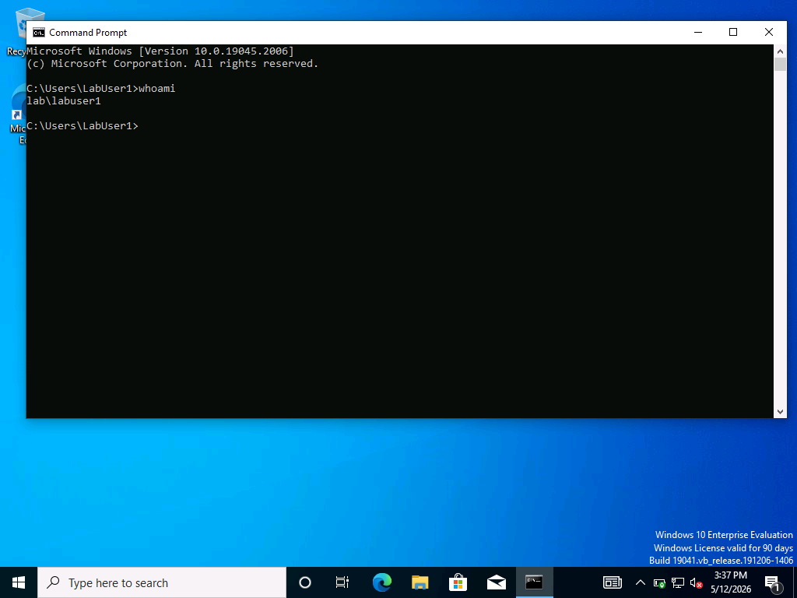

# 🛠️ Active-Directory-Home-Lab
A hands-on Active Directory lab environment built on Windows Server 2022 and Hyper-V, featuring automated user management and group policy configuration via PowerShell.

## 🚀 Progress Tracking
- [x] Initial VM Creation & Hardware Configuration
- [x] OS Installation (Windows Server 2022 Standard)
- [x] Server Renaming & Static IP Configuration
- [x] Active Directory Domain Services (AD DS) Installation
- [x] Post-Promotion Domain Verification
- [x] PowerShell Automation Script Execution

## 💻 System Specifications (Audited)
To ensure stability during the installation, the virtual environment was configured as follows:

| Component | Value | Documentation Note |
| :--- | :--- | :--- |
| **Virtualization** | Microsoft Hyper-V (Gen 2) | UEFI-based for modern OS support |
| **Operating System** | Windows Server 2022 | Desktop Experience (GUI) selected |
| **Memory (Startup)** | 2048 MB (2 GB) | Increased from 524 MB for installer stability |
| **Storage** | 49 GB VHDX | Thin-provisioned virtual storage |

## ⚠️ Troubleshooting & Lessons Learned
* **The RAM Trap:** Attempting to boot the Windows Server 2022 installer with 524 MB of RAM (as suggested in some guides) caused the boot loader to fail. Increasing the startup RAM to **2 GB** was the critical fix.
* **Boot Priority:** Corrected a "No boot image found" error by manually adjusting the **SCSI Controller** settings to prioritize the DVD/ISO drive over the unallocated hard disk.
* **Hyper-V "Press Any Key":** Identified that the 2-second boot window requires immediate focus on the VM window to initiate the OS installer.

---

## 🔧 Detailed Hyper-V Configuration
To replicate this environment, ensure the following settings are applied in Hyper-V Manager:

* **Generation:** Generation 2 (supports UEFI and Secure Boot).
* **Security:** * **Secure Boot:** Enabled (Standard Windows template). *Note: Temporarily disabled during initial ISO boot troubleshooting.*
    * **TPM:** Enabled (Required for specific Windows Server security features).
* **Processor:** 2 Virtual Processors (minimum recommended for Server 2022 GUI).
* **Memory:** * **Startup RAM:** 2048 MB.
    * **Dynamic Memory:** Disabled (to ensure consistent performance during AD DS promotion).
* **Storage:** * **Controller:** SCSI Controller.
    * **Drive 0:** 49GB VHDX (Dynamically expanding).
    * **Drive 1:** DVD Drive (Mapped to Windows Server 2022 ISO).
* **Networking:** Connected to `Default Switch` (provides NAT/Internet access for updates).

## ⚙️ Post-Installation Configuration
Before promoting the server to a Domain Controller, I performed the following "Identity" configurations:

* **Server Renaming:** Successfully changed the default hostname to **`DC01`**. This ensures standardized naming for the primary Domain Controller in the `lab.local` forest.
* **Static IP Assignment:** Transitioned from DHCP to a static configuration to ensure consistent network resolution.
    * **IPv4 Address:** `172.20.112.111`
    * **Subnet Mask:** `255.255.240.0`
    * **Default Gateway:** `172.20.112.1`
* **DNS Strategy:** Configured the Preferred DNS to the loopback address (**127.0.0.1**). This ensures the server references its own AD database for name resolution once the AD DS role is active.

## 🌳 Active Directory Domain Services (AD DS) Configuration
After preparing the server environment, I successfully promoted `DC01` to a Domain Controller. This established the root of the forest and the primary identity management system for the lab.

### 🛠️ Promotion Specifications
* **Deployment Operation:** Add a new forest.
* **Root Domain Name:** `lab.local`
* **NetBIOS Name:** `LAB`
* **Forest/Domain Functional Level:** Windows Server 2016 (Ensures compatibility while providing modern security features).
* **Global Catalog:** Enabled (Primary server for the forest).
* **DNS Server:** Enabled (Integrated with AD DS for seamless name resolution).

### ✅ Post-Promotion Verification

Following the mandatory reboot, I verified the success of the promotion by:
1. **Login Credentials:** Confirmed the login screen now reflects the domain identity (`LAB\Administrator`).
2. **Directory Services:** Verified the presence of the **Active Directory Users and Computers (ADUC)** console.
3. **DNS Validation:** Confirmed that the `lab.local` zone was automatically created and populated with the DC's A-record.

*Figure 1: Verified lab.local domain structure in ADUC.*

## 🤖 PowerShell Automation Phase
To demonstrate efficiency and scalability, I utilized PowerShell to automate the creation of directory objects. This phase simulates how a System Administrator would manage large-scale user on-boarding.

### 📜 Script Logic:
* **Organizational Unit (OU) Creation:** Established a `Lab_Users` OU to provide a clean structure for managed accounts.
* **Security Group Management:** Created the `Lab_Admins` group to practice the Principle of Least Privilege (PoLP).
* **Automated Bulk Creation:** Implemented a `ForEach-Object` loop to generate five test users with standardized naming conventions and secure initial passwords.

### 📊 Automation Result

*Figure 2: The final directory state showing the Lab_Users OU populated with automated accounts and groups.*

## 🖥️ Phase 2: Client Workstation Integration
To simulate a real-world corporate environment, I deployed a Windows 10 Enterprise workstation and successfully joined it to the `lab.local` domain. This phase demonstrates the practical application of central identity management and client-server networking.

### 💻 Client Specifications (Workstation01)
To maintain performance within the virtual environment, the workstation was configured as follows:

| Component | Value (Workstation01) | Documentation Note |
| :--- | :--- | :--- |
| **Operating System** | Windows 10 Enterprise Eval | 22H2 (x64) Build |
| **Memory (Startup)** | 2048 MB (2 GB) | Adjusted from 512 MB to prevent installer hangs |
| **Storage** | 49 GB VHDX | Dynamically expanding (Thin Provisioning) |
| **Networking** | Default Switch | Internal communication path to DC01 |

### 🌐 Virtual Networking & DNS Troubleshooting
A primary challenge during this phase was a "Domain Controller Not Found" error when attempting the initial join.
*   **The Issue:** The workstation was unable to resolve the `lab.local` name via the default gateway.
*   **The Fix:** Manually configured the workstation's IPv4 properties to point to the Domain Controller's static IP (`172.20.112.111`) as the Preferred DNS server.
*   **Validation:** Verified connectivity using `ping lab.local`, ensuring a direct resolution path before re-attempting the join.

### 🔗 Domain Integration & Verification
The workstation was successfully renamed to **`WS01`** and joined to the forest, allowing for centralized management of the device and its users.

*Figure 3: Authenticating with Domain Administrator credentials to authorize the workstation join.*

*Figure 4: Successful integration of WS01 into the lab.local managed environment.*

### 🔑 Final Validation: Domain User Login
To confirm the end-to-end functionality of the lab, I performed a login test using one of the automated accounts created in Phase 1:
1.  **User:** `LAB\LabUser1`
2.  **Verification:** Ran the `whoami` command in the terminal to confirm the workstation recognized the domain identity.
3.  **Result:** Successfully authenticated against the Domain Controller, confirming that the GPOs and Directory Services are correctly exposed to the client.

### 🔑 Final Validation: Domain Identity Verification
The final test of the environment was to verify that a domain-level user could successfully authenticate and log in to the newly joined workstation. 

*   **Authentication Test:** Logged out of the local 'Admin' account and successfully authenticated using the `LabUser1` credentials previously provisioned via PowerShell.
*   **Identity Audit:** Executed the `whoami` command to confirm the active session was tied to the `lab.local` domain rather than the local machine database.

*Figure 5: Verification of successful domain login for LabUser1 on WS01.*
